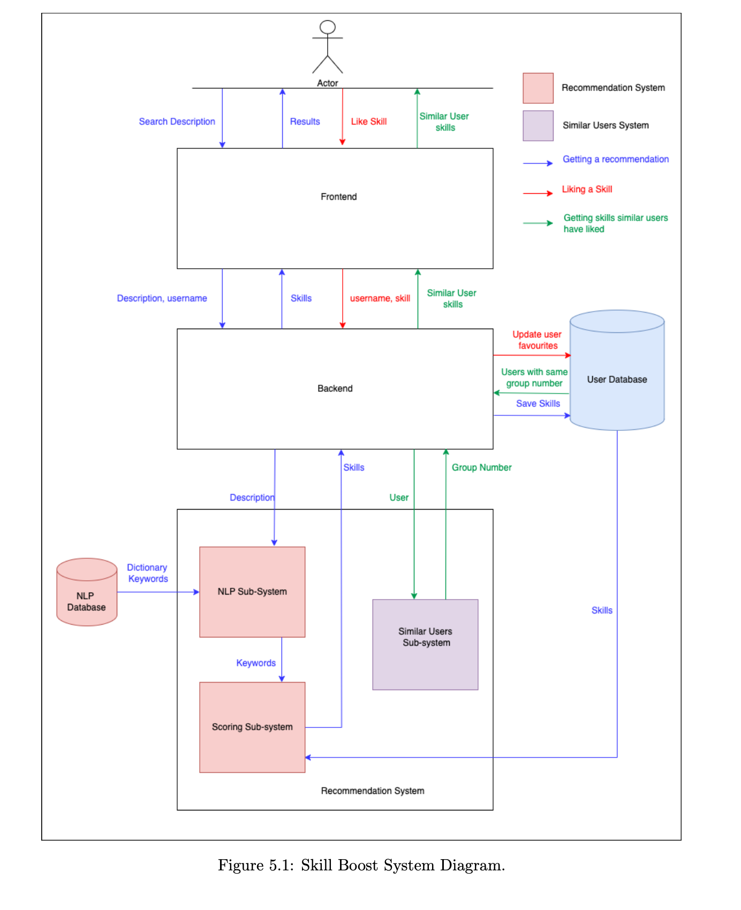

# Skill Boost: Personalised Content Recommendations for Student Skill Enhancement

## 📖 Overview
Skill Boost is a **personalised learning recommendation platform** developed as my final-year Computer Science dissertation project.  
It enhances students’ learning journeys by providing **tailored content and skill suggestions**, powered by:

- **Natural Language Processing (NLP)** to interpret free-text user goals  
- **Content-based filtering** for resource recommendations  
- **Collaborative filtering** to suggest new skills based on similar learners  

The system is fully containerised with **Docker**, making setup and deployment simple.

---

## 🛠️ Tech Stack
- **Frontend:** React (student dashboard)  
- **Backend API:** FastAPI 
- **Recommender Service:** Python (NLP, content-based + collaborative filtering)  
- **Database:** MongoDB  
- **Deployment & DevOps:** Docker, Docker Compose, GitHub Actions  

---

## 🚀 Quick Start

### 1. Prerequisites
- Ensure **[Docker](https://docs.docker.com/get-docker/)** is installed and running

### 3. Clone the repository
```bash
git clone https://github.com/lucyinett/skill-boost.git
cd skill-boost
```
### 3. Build the containers
```bash
docker-compose build
```
### 4. Run the application
```bash
docker-compose up
```
The application will be available at:  
👉 [http://localhost:3000](http://localhost:3000)

---

## 🧩 Services
- **Frontend:** [http://localhost:3000](http://localhost:3000)  
- **Backend API:** [http://localhost:8000](http://localhost:8000)  
- **Recommender Service:** [http://localhost:9000](http://localhost:9000)  
- **Database:** PostgreSQL (localhost:5432)  

---

## 🏗️ System Architecture
The Skill Boost system integrates a frontend, backend API, NLP components, collaborative filtering, and a database.


---

## 📊 Results
- Successfully delivered **personalised recommendations** aligned with user learning goals  
- Demonstrated feasibility of combining **NLP + hybrid filtering** for educational contexts  
- Overcame data access limitations by **generating synthetic datasets** with generative AI  

---
---

## 📄 Dissertation & 🌐 Portfolio
This project was developed as part of my dissertation:  
**“Skill Boost: Personalised Content Recommendations for Student Skill Enhancement”**

The full dissertation is available on my portfolio site:  
👉 [View on Portfolio](https://lucyinett.co.uk)


